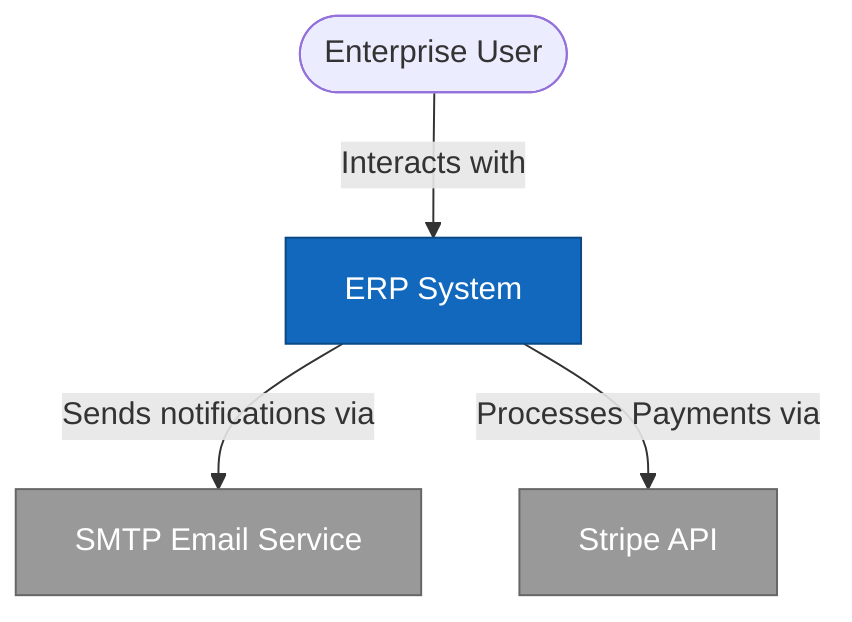
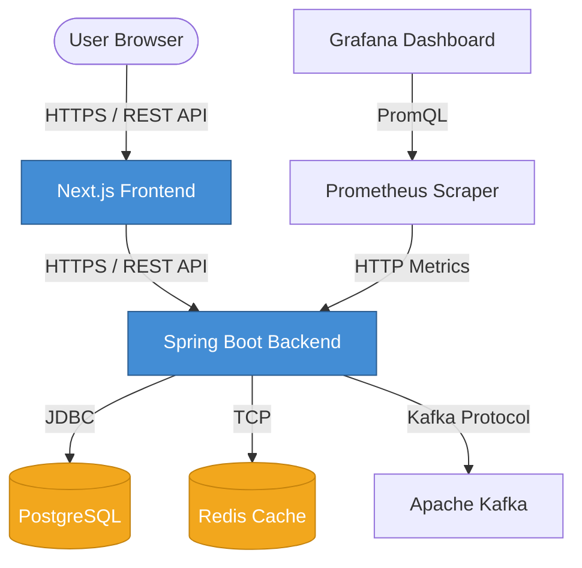
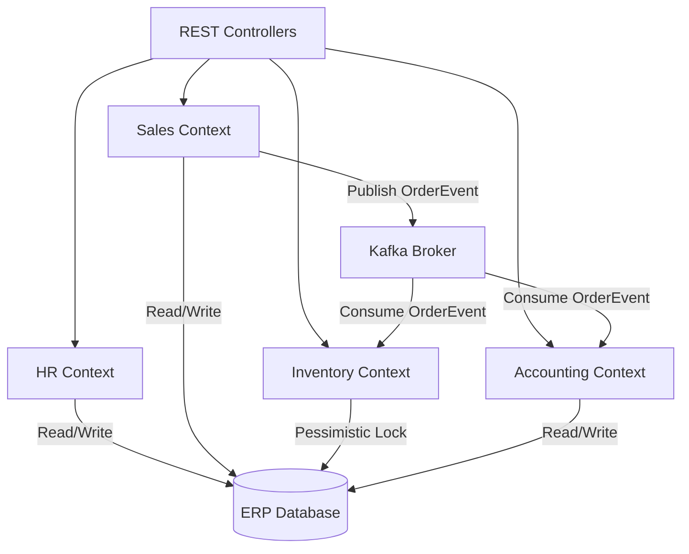

# 🏗️ C4 Model Architecture Diagrams

This document outlines the Enterprise Architecture of the ERP system using the C4 Model methodology (Context, Container, Component).

## 1. System Context Diagram
Shows how the ERP system fits into the world around it.

## 2. Container Diagram
Zooms into the System boundary to show the high-level technical architecture.

## 3. Component Diagram (Backend Modules)
Zooms into the Spring Boot backend to show the bounded contexts (Modular Monolith).

