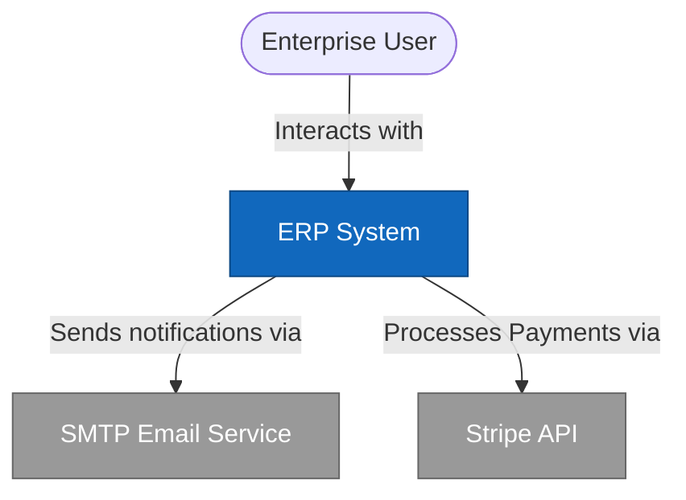
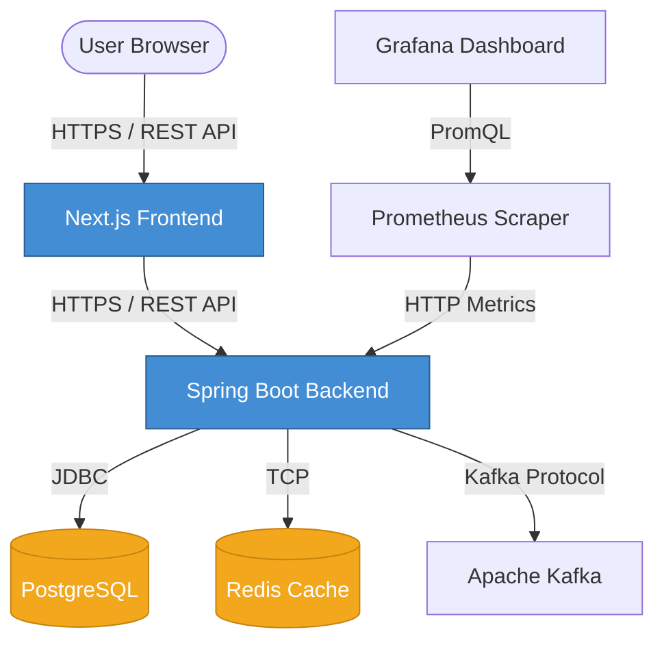
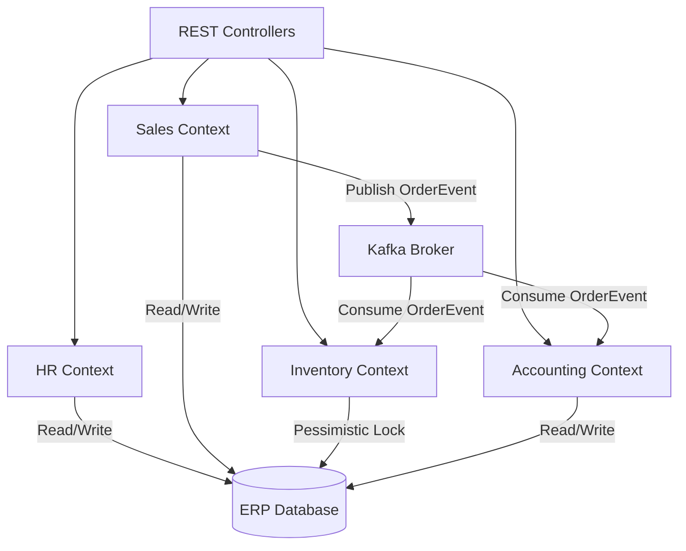

# 🏢 Enterprise Resource Planning (ERP) System - Master Documentation

This document serves as the single source of truth for the Architecture, Operations, API, and Compliance guidelines for the ERP system.

---

## Part 1: C4 Model Architecture 

### 1. System Context Diagram
Shows how the ERP system fits into the world around it.

### 2. Container Diagram
Zooms into the System boundary to show the high-level technical architecture.

### 3. Component Diagram (Backend Modules)
Zooms into the Spring Boot backend to show the bounded contexts (Modular Monolith).

---

## Part 2: Operations Manual & Day-2 Procedures

### Monitoring Dashboards (Grafana)
Grafana is the primary interface for tracking system health.
- **Access**: `http://localhost:3001` (or production URL)
- **Primary Dashboard**: "JVM (Micrometer)" - Displays heap usage, GC pauses, request throughput, and API latency.
- **Alerting**: If Memory Utilization exceeds 85%, Grafana will fire an alert to PagerDuty.

### Distributed Tracing (Jaeger)
When an alert is triggered (e.g., API latency > 500ms), engineers must use Jaeger to trace the request.
- **Access**: `http://localhost:16686` (via K8s Port Forwarding)
- **Usage**: Search for the `traceId` found in the ELK logs. Jaeger will visualize the exact bottleneck across the bounded contexts.

### Managing Kafka Topics
If a dead-letter queue (DLQ) fills up, or offsets need to be reset:
- Connect to the Kafka pod: `kubectl exec -it erp-kafka-0 -- /bin/bash`
- List Topics: `kafka-topics --bootstrap-server localhost:9092 --list`

---

## Part 3: API Documentation (OpenAPI)

The ERP System is built with a RESTful API adhering to the OpenAPI 3.0 specification. The backend dynamically generates interactive documentation via **Swagger UI**.

1. Ensure the backend is running locally.
2. Open your browser and navigate to:
   - **Swagger UI**: [http://localhost:8080/swagger-ui.html](http://localhost:8080/swagger-ui.html)
   - **OpenAPI JSON Spec**: [http://localhost:8080/v3/api-docs](http://localhost:8080/v3/api-docs)

### Authentication (JWT)
To test secured endpoints via the Swagger UI:
1. Hit the `POST /api/auth/login` endpoint with valid credentials to receive a JWT Token.
2. Click the green **Authorize** button at the top of the Swagger UI.
3. Paste your token in the format: `Bearer <your-jwt-token>`.

---

## Part 4: Corporate Security & Compliance

### Information Security Policy (ISO 27001)
- **Encryption at Rest**: All PostgreSQL and Redis databases are encrypted using AES-256 via AWS KMS.
- **Encryption in Transit**: All communication between internal microservices and external clients is enforced over TLS 1.3.
- **Principle of Least Privilege**: Access to production environments requires multi-factor authentication (MFA).

### SOC 2 Audit Runbook & Disaster Recovery
- **RTO (Recovery Time Objective)**: 4 Hours
- **RPO (Recovery Point Objective)**: 15 Minutes
- **Procedure**: In the event of a US-East-1 regional outage, the automated Jenkins Blue-Green pipeline will failover to US-West-2. RDS automated backups will be restored in the new region.
- **Continuous Auditing**: All pull requests must pass automated Checkmarx and OWASP ZAP scans via GitHub Actions before merging. ELK logs are shipped to a Write-Once-Read-Many (WORM) S3 bucket to prevent tampering.
